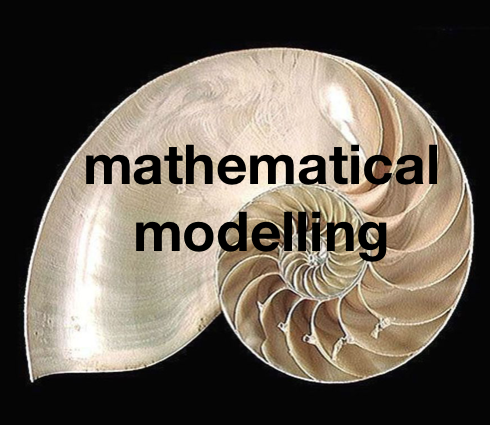

# Mathematical-modelling

## About this Project

The purpose of this repository is to present some Mathematical and Computational Modelling projects. Different programming languages will be use in different Science problems. The idea is to explore numerical and discrete units programming while different problems are simulated.

To follow up the projects presented in this repo you will need to install C compiler such as gcc or icc if your machine does not have in-built, as well fortran (e.g. gfortran) and python.

Additional softwares will be use, for instance, VMD (Visual Molecular Dynamics) is used to simulated particles throug Molecular Dynamics / Langevin Equation and Brownian Motion. As new projects with additional softwares are added in this repo, readme.md will be updated.

Projects explored here are very important helping to develop and improve Math/Physics concepts as well master programming skills. Topics that can be considered in these scenarios, for instance are:

- Euler Method;
- Random number generators;
- Molecular Dynamics;
- Parallelism through Langevin Particles Motion;
- Forecast in industries problems;
- Agent-based models;
- And more...

## Authors

* **Ivaldo Tributino** - [Tributino](https://github.com/Tributino)
* **Marcos Machado** - [machadomr](https://github.com/machadomr)

See also the list of [contributors](https://github.com/Tributino/Learning-Through-Kaggle-competition/contributors) who participated in this project.
